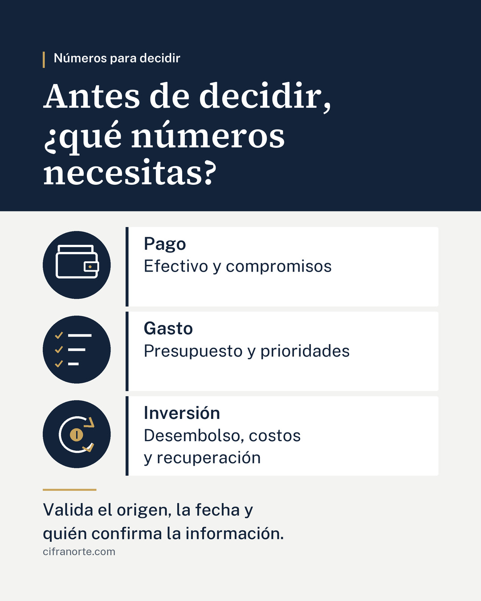

# IM01 LinkedIn · Infografía para revisión

Estado: enfoque aprobado por Hugo; diseño pendiente de Claude y aprobación final. No incorporado a la publicación programada.

## Encargo aprobado
Titular: «Antes de decidir, ¿qué números necesitas?».
Tres bloques con iconos: pago → efectivo y compromisos; gasto → presupuesto y prioridades; inversión → desembolso, costos y recuperación.
Cierre común: «Valida el origen, la fecha y quién confirma la información».

Se conserva el [copy aprobado](COPY_APROBADO.txt) como texto que acompaña la imagen, sin ninguna reescritura. Esta infografía es un complemento solicitado por Hugo después de programar la versión solo texto; no es IM02.

## Texto de la imagen
Números para decidir

Antes de decidir, ¿qué números necesitas?

Pago
Efectivo y compromisos

Gasto
Presupuesto y prioridades

Inversión
Desembolso, costos y recuperación

Valida el origen, la fecha y quién confirma la información.

cifranorte.com

## Producción y comprobaciones de ChatGPT
- PIL, 2160 × 2700 de origen, reducido con LANCZOS a 1080 × 1350. JPG calidad 92.
- TTF estáticos oficiales: SourceSerif4-SemiBold; PublicSans Regular, Medium y SemiBold, comprobados contra el ZIP oficial.
- Paleta del proyecto: #13233A, #C9A45C, #F3F4F1, #FFFFFF y #56606E. Dorado decorativo; sin logo.
- Iconos de línea dibujados con PIL: cartera, lista de prioridades y recuperación de capital. Ilustraciones conceptuales; sin cifras de rendimiento ni promesas.
- Tres decisiones independientes, sin flechas que sugieran una secuencia de pasos.
- Márgenes de texto mínimos de 96 px, sin progreso/numeración por tratarse de una imagen única.
- Inspección visual completa y miniatura de 360 px realizada; sin recortes ni superposiciones.
- Textos guardados en UTF-8 sin U+FFFD.
- No se ha cambiado Metricool. No se han modificado Facebook, Instagram ni COPY_APROBADO.txt.

## Dictamen de Claude
- **Fecha:** 6 de octubre de 2026.
- **Commit revisado:** 8b2c19c (`01.jpg`, 1080 × 1350, RGB). Versión vigente comprobada en `main` antes de revisar.
- **Resultado: NO APTA en esta versión, por un solo motivo (N1).** Corregido N1, queda apta sin otra revisión de fondo; las demás observaciones son opcionales.
- **Revisado:** imagen completa, miniaturas de 360 px y 216 px, y ampliación de cada icono.

### Lo que funciona
- Fiel al encargo aprobado: titular, tres decisiones (pago, gasto, inversión) y cierre «Valida el origen, la fecha y quién confirma la información», sin cifras, promesas ni flechas de secuencia.
- Coherente con `COPY_APROBADO.txt`: cada bloque resume el párrafo correspondiente (efectivo y compromisos; presupuesto y prioridades; desembolso, costos y recuperación) y el cierre repite la validación de origen, fecha y responsable. No contradice el texto.
- Jerarquía clara: banda marino con titular en Source Serif 4, después los tres bloques y al final el cierre. En miniatura de 216 px el titular y las palabras Pago, Gasto e Inversión se leen sin esfuerzo.
- Contraste suficiente: marino sobre blanco y sobre #F3F4F1; gris #56606E en cifranorte.com, legible. Dorado solo como acento (filete, palomitas, moneda y separador). Sin logo; solo cifranorte.com, conforme a la regla.
- Iconos de pago (cartera) y gasto (lista con palomitas) se entienden de inmediato.
- Acentos y «¿» correctos en la imagen.

### Corrección necesaria
- **N1. Icono de inversión no se entiende.** Las dos puntas de flecha doradas están separadas del arco blanco y apuntan hacia fuera, por lo que se leen como dos signos «>» sueltos y no como un ciclo de recuperación. La moneda con una barra vertical se confunde con un botón de encendido o de pausa. En miniatura se percibe como una «C» con un punto. Propuesta: arco circular continuo con una sola punta de flecha unida al trazo, que regrese hacia la moneda; moneda con «$» o con un filete horizontal en vez de la barra vertical; mismo grosor de línea que los otros dos iconos. No cambiar textos ni colores.

### Correcciones opcionales
- **O1.** cifranorte.com queda casi pegado a la segunda línea del cierre (unos 20 px). Separarlo 40–50 px aprovechando el espacio libre inferior (unos 100 px).
- **O2.** Las tarjetas de Pago y Gasto tienen texto arriba y un hueco vacío abajo, mientras Inversión ocupa toda su tarjeta. Centrar verticalmente el texto en las tres tarjetas, o reducir un poco su alto y pasar ese espacio al cierre, para que el bloque se vea parejo.
- **O3.** Los iconos y el filete marino de cada tarjeta compiten un poco entre sí; si se ajusta O2, el filete puede afinarse (de unos 8 px a 4–5 px). Es solo de acabado.

### Codificación
- Los antecedentes de caracteres dañados ya no aparecen: `COPY_APROBADO.txt` de LinkedIn, el bloque del copy de Facebook en su `REVISION.md`, `COORDINACION.md` y esta ficha son UTF-8 válido sin U+FFFD. Los únicos caracteres de reemplazo que quedan en la ficha de Facebook están dentro de mi dictamen anterior, como cita del problema ya resuelto.
- No modifiqué la imagen, el copy aprobado, Metricool, Facebook ni Instagram. IM02 no iniciado.

## Aprobación y actualización
Pendiente del OK final de Hugo.
Publicación que debe actualizarse después del OK: ID 389683465; UUID 4817284349187277253.
Fecha y hora autorizadas vigentes: 7 de octubre de 2026 a las 09:00, America/Mexico_City.
No crear una segunda publicación. La versión actual sigue programada como texto.
