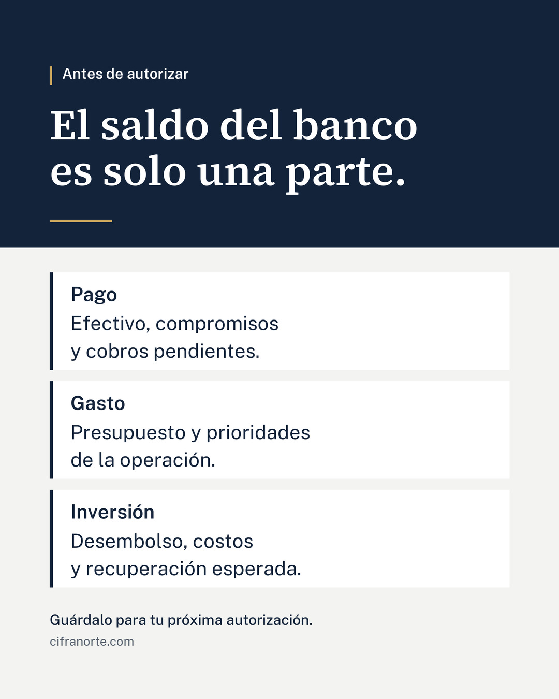

# IM01 Facebook · Revisión pendiente

## Estado vigente tras las correcciones autorizadas por Hugo

6 de octubre de 2026. Restaurados desde los originales UTF-8 los 45 caracteres dañados del bloque de Facebook y los 34 del copy aprobado de LinkedIn, sin cambiar palabras. Verificado: cero caracteres U+FFFD en ambos textos restaurados. El dictamen de Claude se conserva íntegro; sus 10 símbolos de reemplazo son ejemplos históricos del problema, no texto publicable.

Las tres barras laterales de Pago, Gasto e Inversión usan ahora marino #13233A. Comparación del original de alta resolución: ningún cambio fuera de esas barras. Imagen revisada completa y en miniatura. El llamado «Guárdalo para tu próxima autorización» queda únicamente en la imagen; la propuesta histórica de añadirlo al copy queda descartada por Hugo.

Revisión de Claude realizada y correcciones solicitadas aplicadas. Aprobación final de diseño y horarios pendiente de Hugo. No programar, no tocar Instagram y no iniciar IM02. Las menciones anteriores de revisión pendiente o del añadido propuesto se conservan como antecedente y quedan sustituidas por este estado.

Cifranorte · IM01 Facebook · Revisión
Estado: borrador para Claude y Hugo; no programado.
Fecha de calendario: 8 de octubre de 2026. Hora pendiente de aprobación.

IMAGEN
Antes de autorizar
El saldo del banco es solo una parte.
Pago: Efectivo, compromisos y cobros pendientes.
Gasto: Presupuesto y prioridades de la operación.
Inversión: Desembolso, costos y recuperación esperada.
Guárdalo para tu próxima autorización.
cifranorte.com

COPY RECUPERADO — CONSERVADO
¿Tienes los números claros antes de decidir?

Cuando toca autorizar un pago, un gasto o una inversión, ver el saldo del banco es apenas una parte de la revisión.

Antes de dar el sí, conviene saber qué compromisos tienes, qué cobros siguen pendientes y cómo encaja esa decisión en el presupuesto. Si vas a invertir, también necesitas revisar los costos y cómo esperas recuperar lo invertido.

Empieza por una decisión que tengas pendiente. ¿Qué información te falta para tomarla con mayor control? Pide a la persona responsable que la confirme antes de autorizar.

¿Qué información sueles revisar primero?

AJUSTE PROPUESTO PARA REVISIÓN
Añadir al final del copy: «Guárdalo para tu próxima autorización.»
No incorporado aún al copy recuperado.

CONTROL
PIL, fuentes oficiales estáticas, 1080 × 1350, JPG calidad 92; revisión visual completa y miniatura realizada. Margen de 96 px y ausencia de progreso/numeración autorizados por Hugo. Diseño y programación pendientes de aprobación. Revisión de Claude pendiente.

## Criterios para Claude
- Enfoque ya aprobado: el saldo del banco es solo parte de la revisión antes de autorizar, con apoyos pago/gasto/inversión.
- Identidad: marino #13233A, dorado decorativo #C9A45C, acción #1D3A5F, fondo #F3F4F1, blanco #FFFFFF, secundario #56606E; sin logotipo.
- Source Serif 4 SemiBold y Public Sans estáticas oficiales. PIL a 2160×2700, LANCZOS a 1080×1350, JPG calidad 92.
- Hugo aprobó margen mínimo 96 px y omitir progreso/numeración en el gráfico único.
- ChatGPT ya revisó tamaño completo y miniatura. Falta revisión independiente de Claude.
- Valorar si añadir al copy el llamado a guardar propuesto; no tratarlo como aprobado.

## Dictamen de Claude
**Fecha:** 6 de octubre de 2026
**Commit revisado:** `d1b39b9a95da66517df895176d65fb80a9da86e0` (main) · archivos: `01.jpg` (1080 × 1350, RGB) y este `REVISION.md`
**Revisor:** Claude (revisión independiente; no sustituye la aprobación de Hugo)

**Resultado: imagen APTA con ajustes menores. Copy de Facebook en el repositorio NO APTO para publicar tal como está guardado, por un problema de codificación (ver N1).**

### Evaluación de la imagen
- **Fidelidad al enfoque aprobado:** correcta. "Antes de autorizar" + "El saldo del banco es solo una parte." + tres apoyos Pago / Gasto / Inversión. Sin cifras, sin promesas.
- **Jerarquía y claridad:** clara. Titular en Source Serif 4 SemiBold domina; luego nombres de apoyo en Public Sans negrita; luego descripción; cierre en tamaño menor.
- **Miniatura (360 px y 180 px de ancho):** titular y los tres nombres de apoyo se leen sin esfuerzo; descripciones legibles a 360 px; "Guárdalo…" y cifranorte.com quedan pequeños a 180 px, aceptable porque son secundarios.
- **Composición y márgenes:** margen lateral de 96 px respetado en ambos lados; bloque de contenido termina a ~104 px del borde inferior. Equilibrado.
- **Contraste (WCAG):** marino sobre blanco 15.8:1; dorado sobre marino 6.7:1 (solo eyebrow y filete); secundario #56606E sobre fondo 5.8:1. Todos superan 4.5:1.
- **Identidad:** paleta correcta (#13233A, #C9A45C, #F3F4F1, #FFFFFF, #1D3A5F, #56606E), fuentes oficiales, sin logotipo, cifranorte.com al final. Dorado usado como acento.
- **Correspondencia con el copy:** coherente. Pago ↔ compromisos y cobros pendientes; Gasto ↔ presupuesto; Inversión ↔ costos y recuperación. "Prioridades de la operación" y "desembolso" no aparecen en el copy de Facebook, pero no lo contradicen (sí están en el copy aprobado de LinkedIn).

### Correcciones necesarias
- **N1. Acentos y signos destruidos en el repositorio.** En este `REVISION.md` el bloque desde "Cifranorte · IM01 Facebook" hasta "CONTROL" tiene 45 caracteres de reemplazo (U+FFFD, se ven como "�"): "Revisi�n", "decisi�n", "�Tienes…", etc. El daño está en los bytes guardados, no es un problema de visualización; no se puede recuperar desde el archivo. ChatGPT debe volver a escribir ese bloque desde su original en UTF-8 y verificar que no quede ningún "�" (`grep -c $'�'` debe dar 0). Copiar el copy de Facebook desde aquí a Metricool publicaría el texto roto.
- **N2. Mismo daño en `publicaciones/2026-10-07_linkedin_IM01/COPY_APROBADO.txt`:** 34 caracteres U+FFFD ("decisi�n", "deber�a", "�Qu�…"). No lo modifiqué, como se pidió. Antes de programar LinkedIn, ChatGPT debe restaurarlo desde la versión aprobada original en UTF-8, con autorización de Hugo por ser texto aprobado, y confirmar que el contenido es idéntico salvo la codificación.

### Correcciones opcionales
- **O1. Color de las barras laterales.** Pago e Inversión llevan barra dorada y Gasto barra azul acción (#1D3A5F). La alternancia sugiere que Gasto es distinto o menos importante, y no lo es. Sugerencia: las tres del mismo color (marino #13233A, que además reduce el dorado a acento puro). Cambio de producción, no de texto.
- **O2. Espacio vacío a la derecha de las tarjetas.** Las descripciones ocupan ~55 % del ancho de la tarjeta. Es aceptable; si se ajusta, subir el cuerpo de las descripciones un paso para ganar lectura en miniatura en lugar de ensanchar tarjetas.
- **O3. Copy: dos preguntas finales seguidas** ("¿Qué información te falta…?" y "¿Qué información sueles revisar primero?"). Funciona, pero la segunda repite la palabra "información". Solo con OK de Hugo, por ser copy recuperado.

### Añadido propuesto "Guárdalo para tu próxima autorización."
- **En la imagen:** adecuado; es el cierre visual y no compite con el titular.
- **En el copy (aún no incorporado, distinto del copy recuperado):** recomiendo **no añadirlo al final**. El copy ya cierra con una pregunta para comentar; poner después un segundo llamado divide la acción y el llamado a guardar ya está en la imagen. Si Hugo lo quiere en el copy, colocarlo justo antes de la pregunta final, no después. Decisión de Hugo.

### Pendiente fuera de esta revisión
Aprobación de diseño y horario por Hugo; programación no autorizada. Instagram IM01 sin cambios.

## Aprobación de Hugo y programación
Diseño final: pendiente. Horario: pendiente. Programación: no autorizada.
